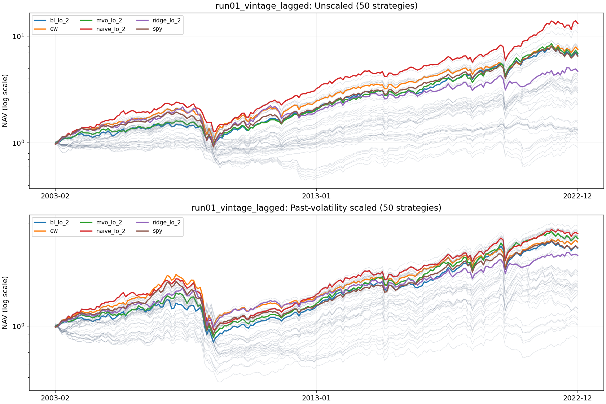
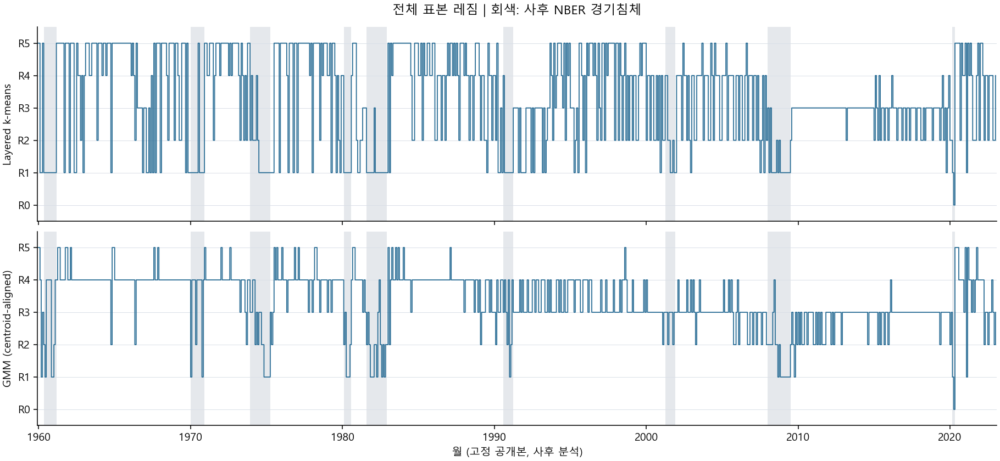
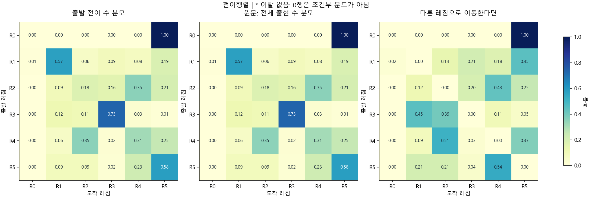
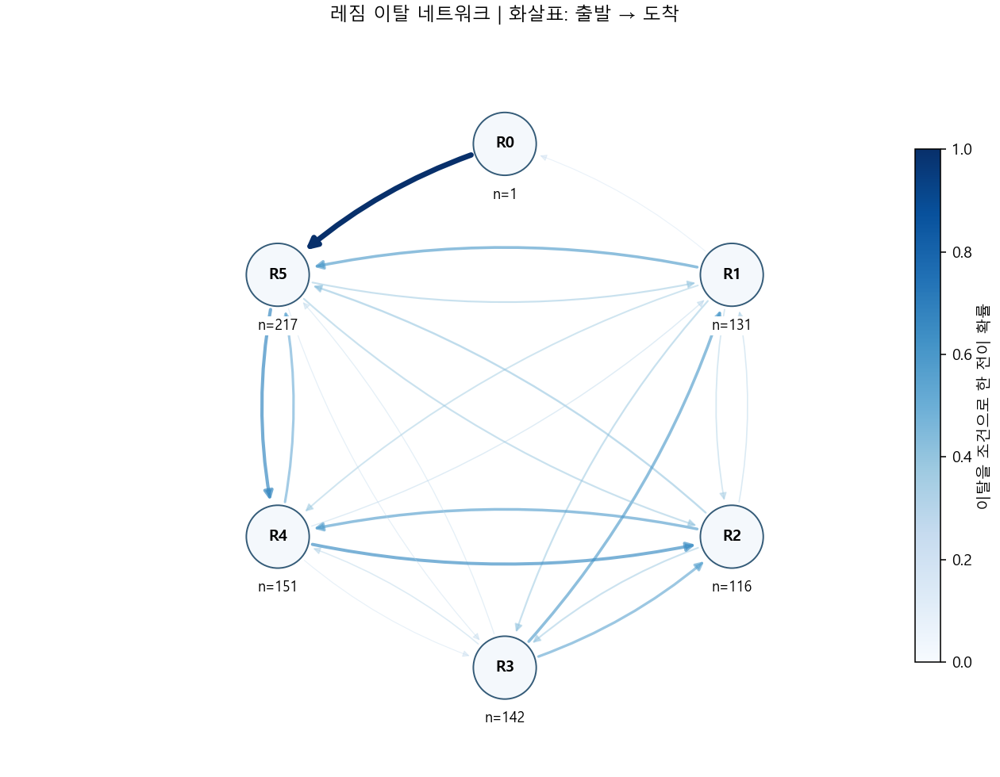

# 거시경제 레짐 기반 ETF 자산배분

논문의 방법을 실제 Yahoo ETF·FRED-MD 자료로 다시 구현한 개인 연구용 Python 패키지입니다. 데이터 준비, 공통 레짐 추정, 예측, 비중 계산, 백테스트, 보고서를 역할별로 나눴습니다.

거시경제 지표를 PCA로 요약하고 경제 상태(regime)를 구분한 뒤, 상태별 예측을 ETF 투자 비중으로 연결합니다. Naive·Ridge·Black–Litterman(BL)·평균–분산 최적화(MVO)를 같은 자료와 회계 기준에서 비교합니다.

[원문 논문](docs/idea_paper.pdf) · [전체 분석 보고서](reports/reproduction/report/report.md) · [실행 안내](docs/operations.md)

## 백테스트 결과

### 실험 구성

| 항목 | 설정 |
|---|---|
| 평가 기간 | 2003-02~2022-12, 239개월 |
| 자산 | SPY 및 9개 섹터 ETF: XLB, XLE, XLF, XLI, XLK, XLP, XLU, XLV, XLY |
| 학습 | 매월 연속 48개월, 결정 시점에 확정된 목표 수익만 사용 |
| 전략 | 4개 모형 × 4개 배분 규칙 × 선택 수 2·3·4 + SPY·균등비중 = 50개 |
| 자료 방식 | 고정 공개본(`fixed_snapshot`) / 과거 공개본에 지연을 적용한 방식(`vintage_lagged`) |
| 기본 성과표 | 변동성 조정 미적용, 거래·차입 비용 0 가정 |

`fixed_snapshot`은 후대에 개정된 2023-02 거시경제 공개본을 사용합니다. `vintage_lagged`는 결정 시점별 과거 공개본에 기본 2개월 지연 가정을 적용합니다. 두 실험은 자료의 정보 수준이 다릅니다.

### 과거 공개본 기준 성과

아래는 네 모형에 동일하게 `lo_2`를 적용한 비교입니다. `lo_2`는 **양수 점수가 높은 최대 2개 ETF에 매수 비중을 배분**하는 규칙입니다. 비교 기준은 SPY와 10개 ETF 균등비중(EW)입니다.

| 전략 | 연복리 수익률(CAGR) | 연 변동성 | Sharpe | 최대낙폭(MDD) |
|---|---:|---:|---:|---:|
| Naive · lo_2 | 13.78% | 15.67% | 0.909 | −46.69% |
| Ridge · lo_2 | 8.05% | 17.75% | 0.529 | −56.14% |
| BL · lo_2 | 9.96% | 15.09% | 0.709 | −37.66% |
| MVO · lo_2 | 10.17% | 14.90% | 0.728 | −39.11% |
| SPY | 9.84% | 16.60% | 0.652 | −52.90% |
| EW | 10.63% | 16.46% | 0.700 | −51.12% |

CAGR은 매년 같은 비율로 불어났다고 환산한 수익률, Sharpe는 수익을 변동성으로 나눈 위험 대비 성과입니다. 최대낙폭은 이전 고점에서 가장 크게 하락한 폭으로, 0에 가까울수록 손실 폭이 작습니다.

이 표에서 Naive는 SPY보다 수익률과 Sharpe가 높았고, BL·MVO는 최대낙폭이 작았습니다. Ridge는 SPY보다 낮은 수익률과 큰 낙폭을 보였습니다. 모든 모형이 일관되게 개선되는 결과는 아닙니다.



위 패널은 기본 전략, 아래는 과거 36개월로 연 10% 변동성을 목표로 조정한 전략입니다. 세로축은 초기 자산을 1로 둔 자산가치의 로그 눈금입니다. 진한 선은 네 모형의 `lo_2`와 SPY·EW, 옅은 선은 나머지 전략입니다. 목표 변동성과 실제 달성 변동성은 다를 수 있습니다.

### 자료 공개본에 따른 차이

| 전략 | 고정 공개본 CAGR | 과거 공개본 CAGR | 고정 공개본 Sharpe | 과거 공개본 Sharpe |
|---|---:|---:|---:|---:|
| Naive · lo_2 | 11.67% | 13.78% | 0.812 | 0.909 |
| Ridge · lo_2 | 11.95% | 8.05% | 0.723 | 0.529 |
| BL · lo_2 | 11.39% | 9.96% | 0.812 | 0.709 |
| MVO · lo_2 | 10.17% | 10.17% | 0.728 | 0.728 |

특히 Ridge는 자료 방식에 따라 성과 차이가 컸습니다. 개정된 경제자료로 얻은 결과를 당시 이용 가능한 정보로 얻은 성과와 구분해야 하는 이유입니다.

[고정 공개본 50개 전략 CSV](reports/reproduction/report/run00_fixed_snapshot_main_metrics.csv) · [과거 공개본 50개 전략 CSV](reports/reproduction/report/run01_vintage_lagged_main_metrics.csv)

## 레짐과 전환 구조

다음 그림은 **1959-12~2023-01의 758개월 전체 표본을 사후 분석**한 결과입니다. 백테스트에서 매월 적합하는 48개월 모형과는 별도 분석입니다. 선택된 102개 경제변수를 52개 PCA 성분으로 요약했으며, 입력 분산의 약 95.16%를 보존했습니다. 이 설명력은 예측 정확도가 아닙니다.

### 시간에 따른 경제 상태



R0는 첫 번째 분할에서 작은 쪽에 속한 이상치 집단이고, R1~R5는 나머지 표본의 군집입니다. 번호 자체가 호황·침체 같은 고정 경제 라벨은 아닙니다. NBER 경기침체 구간은 해석을 위한 사후 대조이며 매매 입력에 사용하지 않습니다.

### 전이행렬과 이탈 네트워크



행은 현재 레짐, 열은 다음 달 레짐입니다. 왼쪽 행렬의 대각선은 같은 상태에 머무는 비율을 뜻합니다. 예를 들어 R3는 약 73%, R1은 약 57%가 다음 달에도 같은 레짐으로 이어졌습니다. 가운데는 논문에 인쇄된 분모를 적용한 비교이고, 오른쪽은 **다른 상태로 이동한 경우만** 모은 조건부 전이입니다.



화살표는 출발 → 도착이며 진할수록 이탈 후 해당 상태로 가는 비율이 높습니다. 예를 들어 R4에서 이탈한 경우 약 51%가 R2로, R5에서 이탈한 경우 약 54%가 R4로 향했습니다. 이는 매달 그 확률로 이동한다는 뜻과 다릅니다.

### 코로나 극단값과 R0

| 사후 분석에서 제외한 기준월 | 전체 월수 | R0 월수 |
|---|---:|---:|
| 제외 없음 | 758 | 1 |
| 2020-03·04 | 756 | 304 |
| 2020-04·05 | 756 | 293 |

제외하지 않은 분석에서 R0는 2020년 4월 한 달뿐입니다. 따라서 그림의 R0 → R5 전이 100%는 **한 번의 관측**이며 안정적인 경제 법칙으로 해석할 수 없습니다. 극단 월을 제외하면 군집 구성이 크게 달라집니다. 기본 백테스트는 해당 월들을 삭제하지 않고 연속 학습 달력을 유지합니다.

## 결과의 범위와 검증

- 전체 기간 성과는 실행 버전 `1541930`에서 생성한 저장 결과입니다. 후속 코드 변경과 전체 기간 재실행을 구분해 기록했습니다.
- 대조·민감도는 별도의 짧은 구간에서 실행 연결을 확인했습니다. 장기 통계적 우위나 모든 가정에 대한 안정성을 입증한 결과는 아닙니다.
- Yahoo 수정주가는 논문의 WRDS 원자료와 다릅니다. 과거 월별 공개본과 지연 가정도 정확한 일별 최초 발표 기록을 대체하지는 않습니다.
- 통합 테스트 369개와 프로젝트 정리 후 관련 테스트 17개가 통과했습니다. 세부 실행 범위·연구 가정·기존 발견 25개의 처리 상태는 [분석 보고서](reports/reproduction/report/report.md)와 [검증 기록](reports/reproduction/verification.json)에 있습니다.

## 빠른 시작

저장소 루트의 PowerShell에서 실행합니다. 현재 준비된 독립 환경과 원자료를 사용합니다.

```powershell
& '.\.venv-research\Scripts\python.exe' -X utf8 -m regime_alloc --help
& '.\.venv-research\Scripts\python.exe' -X utf8 -m regime_alloc run --config configs/vintage_lagged.toml --output artifacts/my-smoke --smoke
& '.\.venv-research\Scripts\python.exe' -X utf8 -m regime_alloc report --run artifacts/my-smoke --output artifacts/my-smoke-report
& '.\.venv-research\Scripts\python.exe' -X utf8 -m regime_alloc verify --run artifacts/my-smoke --report artifacts/my-smoke-report
```

출력 폴더는 매번 새 이름을 사용합니다. `--smoke`는 최초·2020-04·마지막 월을 각각 확인하므로 이어 붙인 투자 성과가 아닙니다. 설치와 자료 확보, 전체 기간 명령은 [실행 안내](docs/operations.md)에 있습니다.

## 구조

```text
src/regime_alloc/
  data/        Yahoo·FRED·NBER 원자료, 거래일과 공개본
  features/    48개월 학습 창, 결측 처리, 표준화·PCA
  regimes/     공유 레짐 상태, 확률·전이
  models/      Naive·Ridge·BL·MVO, 검증 방식
  portfolio/   lo·lns·los·mx 비중, 변동성 조정
  backtest/    실행·회계·지표·대조·민감도
  reporting/   전체 표본 해석·보고서·산출물 점검
configs/       명시적 연구 가정
tests/         작은 수학 반례와 실제 자료 연결 검사
docs/          현재 실행 안내·연구 규칙·원문 논문
```
