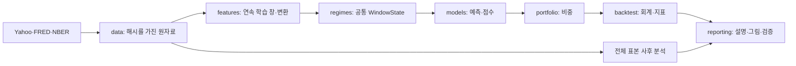

# 구성과 자료 흐름

Python 3.11의 파일 기반 연구 패키지다. CLI가 TOML 설정을 읽고 실행 계층을 호출한다. yfinance·공식 FRED 다운로드는 data 경계에만 있으며, 계산과 보고서는 저장한 원자료를 읽는다.

대표 실행은 CLI → ExecutionContext → 학습 창 → 하나의 WindowState → 네 모형 → 50개 전략 → 독립 실행 폴더 순서다. 특징과 레짐을 전략마다 재적합하지 않는다. 상태의 식별자·기간·좌표가 일치해야 예측에 사용할 수 있다. NumPy/Pandas가 표와 행렬, SciPy/scikit-learn이 수치 추정, Matplotlib이 그림을 담당한다.

backtest는 계산 모듈을 조립하고 파일 쓰기를 소유한다. portfolio는 비중만 계산하며 원자료를 다운로드하지 않는다. reporting은 저장된 결과를 읽고 별도 출력 폴더를 만든다. 전체 표본 분석은 거래 창과 다른 범위를 가지며 매매 입력으로 들어가지 않는다. NBER는 이 사후 해석 경로에만 들어간다.

공통 config/contracts는 하위 계산에 의존하지 않는다. 새 패키지는 audit_tests나 옛 Step 파일을 import하지 않는다. 과거 감사는 별도 Git 버전에서 읽기·격리 실행으로 재현한다. 네트워크를 통과하는 것은 공개 원자료 요청이며 주문·계좌 정보는 없다.
