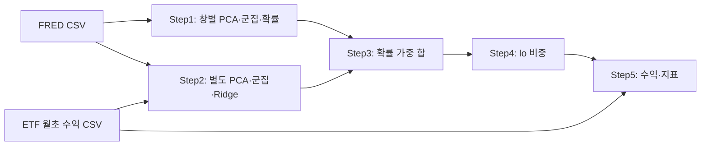

# 구성과 자료 흐름

개인 연구용 파일 기반 Python 프로젝트다. 원 연구 스크립트는 NumPy/Pandas로 거시경제 자료를 처리하고, PCA·군집·Ridge·자산 비중·성과를 CSV와 NPZ로 전달한다. 별도 진단 CLI는 이 구현을 읽어 독립 계산과 비교한다.

## 연구 계산

Step1과 Step2는 현재 군집 결과를 공유하지 않는다. CSV에 같은 레짐 번호가 있어도 같은 분할을 뜻한다는 보장이 없다. Step3/4에는 선행 파일이 없을 때 거시경제 처리와 합성 ETF 생성을 다시 수행하는 경로가 있다.

Section3는 전표본 PCA·군집·확률·전이를 계산하는 별도 분석이다. 그 출력은 통계·레짐·전이 시각화가 소비한다. rolling 전략의 창내 적합과는 다른 추정 범위를 가진다. 원 ETF loader의 외부 제공자는 Yahoo이며 논문 실험의 WRDS와 다르다.

## 진단 계산

audit_tests/run_audit.py가 데이터·레짐·예측·성과/연결 네 영역을 직렬 호출한다. common.py는 원 소스의 함수/AST와 해시를 다루고, metrics_support.py는 임시 폴더에서 원 스크립트를 실행한다. NumPy/SciPy는 수치 계산, scikit-learn은 일부 독립 비교와 원 fallback 실행, Matplotlib은 화면 없는 시각화 실행에 사용된다. pypdf는 지정 PDF의 페이지 수를 확인한다.

대표 연결 검사는 실제 FRED 첫 48행과 명시한 합성 ETF를 원 Step1/2의 첫 반복에 넣고, 만들어진 CSV를 원 Step3→4→5 전체에 전달한다. 출력의 날짜·행 수·집계·비중·수익을 독립 계산과 비교하여 reports/paper_audit/evidence 아래에 보존한다. 이 경계를 넘는 값은 입력·예측·비중·지표이며 실거래 주문은 없다.

check_artifacts.py는 보고서·발견 JSON·대응표와 통합 실행 기록을 읽어 참조·건수·출처가 맞는지 확인한다. 진단에서 연구 코드로 향하는 의존성은 읽기와 격리 실행이고, 연구 스크립트는 진단 패키지에 의존하지 않는다. 공개 서버나 배포 서비스는 없다.
