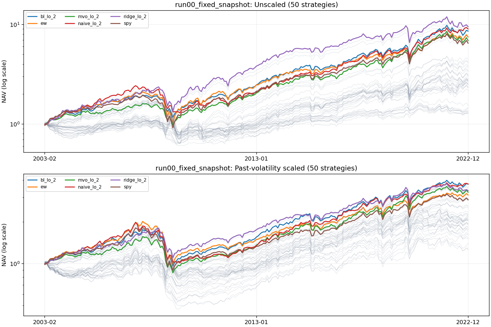
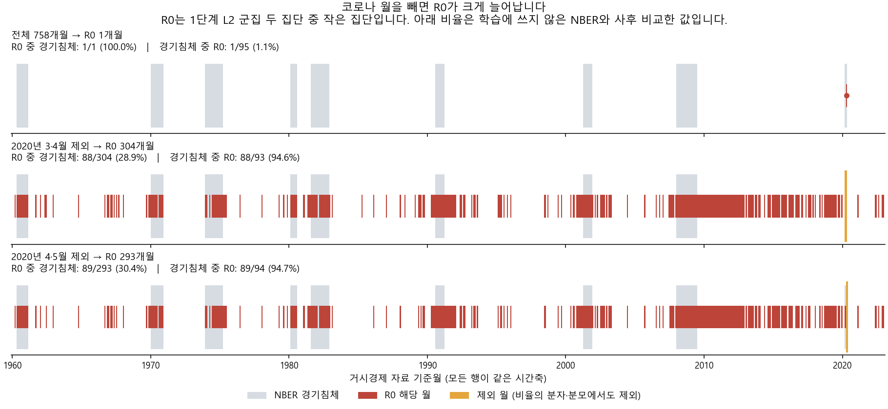
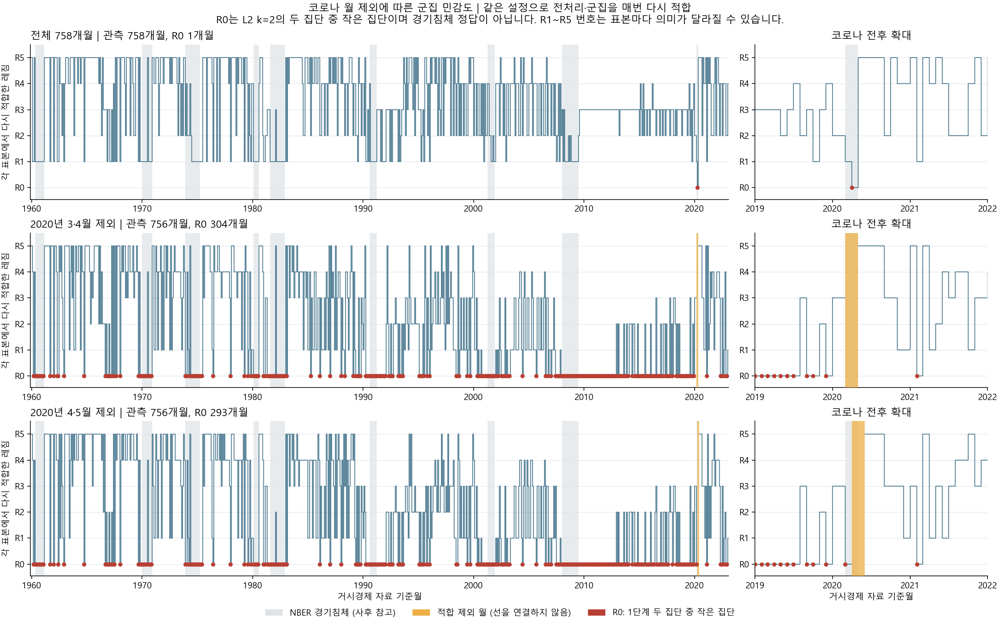
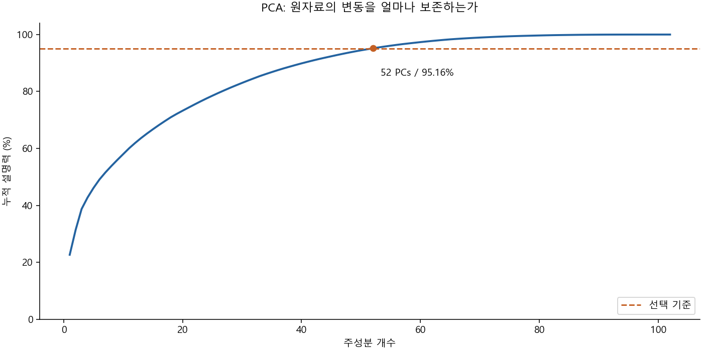
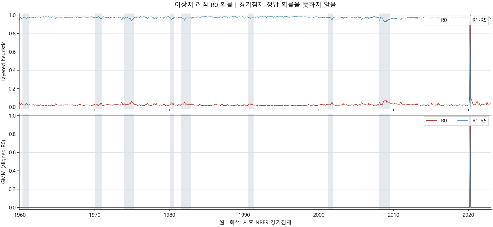
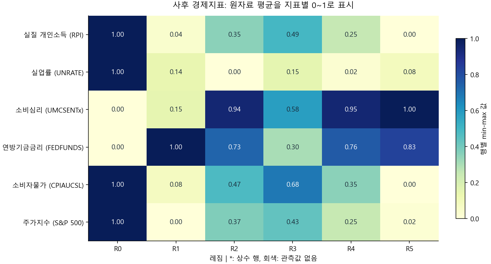
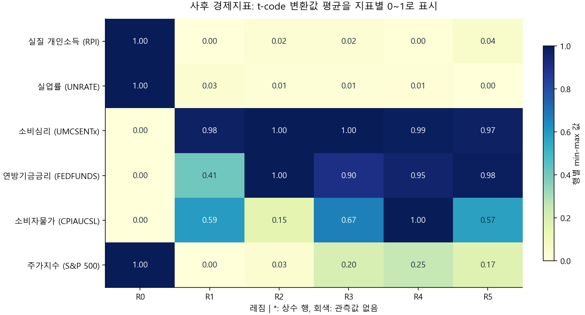
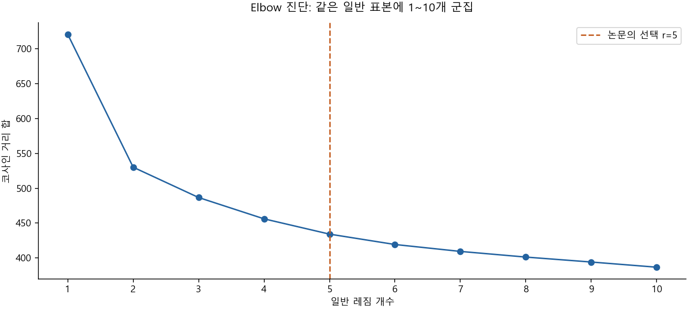

# 거시경제 레짐 자산배분 재구현 보고서

## 먼저 읽을 결론

이 보고서는 **실행 가능한 재구현과 수행한 범위의 증거**를 설명한다. 원 논문 전체 실험을 최종 코드로 완전 재현했다고 주장하지 않는다. 보고서 생성은 저장 결과를 읽고 그림을 만들며, 모델을 다시 학습하거나 실험을 새로 실행하지 않는다.

수익률은 소수 단위다(0.10=10%). 기본 성과 표는 비조정 전략이며, 변동성 조정 곡선은 별도다. 여러 전략 중 높은 결과를 사후 선택한 값은 미래 투자 성과의 보장이 아니다.

## 계산을 이해하는 작은 예

### 경제 자료 → 레짐 → 예측

PCA는 같이 움직이는 경제지표를 요약한다. 고용지표 다섯 개가 비슷하게 움직이면 그 공통 움직임을 하나의 축으로 압축할 수 있다. **분산 설명력 95%는 입력 움직임의 보존 정도이며 예측 정확도 95%가 아니다.** 전처리·PCA는 거래 판단의 학습 표본 안에서 적합한다.

아주 먼 한 점은 두 집단 나누기를 좌우할 수 있다. 첫 L2 분할의 작은 집단을 R0로 두고 나머지를 cosine 기준으로 나눈다. 레짐 이름은 침체 정답이 아니다. 서로 다른 PCA 창을 비교할 때 원래 변환 변수 좌표로 되돌려 맞춘다. 거리 소속도는 부드러운 가중치이며 보정된 경기침체 확률이 아니다. NBER는 사후 대조용이며 예측 입력이 아니다.

Ridge는 계수가 너무 커지는 것을 억제한다. λ를 늘리면 복잡한 반응을 더 강하게 제한한다. LOO는 한 관측을 숨겨 점수를 매기며 절편의 1/n 효과를 포함한다. 기본 LOO는 외부 48개월의 특징 공간·소속을 조건으로 한다. 전진 검증은 과거 시점마다 다시 적합하며, 기본의 레짐별 λ와 달리 ETF별 공통 λ를 선택하므로 두 결과 차이를 검증 방식 하나의 효과라고 단정할 수 없다.

### 예측값 → 비중 → 순수익

예를 들어 양수 점수가 0.02와 0.01이면 절댓값 합 0.03으로 나눈 lo 비중은 2/3와 1/3이다(설명용 숫자). Naive의 조건부 Sharpe 점수, Ridge의 기대수익, BL의 사후 기대수익, MVO의 효용 방향은 의미가 다르며 어느 것도 곧바로 최종 비중은 아니다. lo는 양수, lns는 양·음수 각각, los는 절댓값 순위, mx는 다음 레짐에 따라 배분법을 선택한다.

초기 자산 1에서 첫 달 10% 손실이면 자산은 0.9이고 낙폭은 -10%다. 수익은 비중×ETF수익의 합에 현금수익을 더하고 거래·차입·조달 비용을 뺀다. 다음 달 거래 전 비중은 이번 달 수익으로 변한 보유액을 순자산으로 나눈 값이다. 과거 변동성 조정은 당시 알려진 수익만 사용하며 실제 달성 변동성이 정확히 10%라는 뜻은 아니다.

## 실행 증거와 버전

### 고정 공개본 전체 기본 결과 / fixed_snapshot

실제 저장 표본: 2003-02~2022-12, 239개월, 50전략. 범위: 1541930 /239개월/50전략/후속코드 전체재실행 아님.

[전체 지표 CSV](run00_fixed_snapshot_main_metrics.csv) · [정의 불가 사유](run00_fixed_snapshot_metrics_reasons.json)

| strategy_id | n_months | cagr | ann_vol | sharpe | sortino | maxdd | positive_ratio |
| --- | --- | --- | --- | --- | --- | --- | --- |
| naive_lo_2 | 239 | 0.1167 | 0.1508 | 0.8116 | 1.2398 | -0.4668 | 0.6151 |
| naive_lo_3 | 239 | 0.1057 | 0.1494 | 0.7513 | 1.1027 | -0.4632 | 0.6276 |
| naive_lo_4 | 239 | 0.1000 | 0.1459 | 0.7304 | 1.0615 | -0.4626 | 0.6360 |
| naive_lns_2 | 239 | 0.0577 | 0.1530 | 0.4452 | 0.6460 | -0.4160 | 0.6192 |
| naive_lns_3 | 239 | 0.0473 | 0.1476 | 0.3885 | 0.5577 | -0.3695 | 0.6025 |
| naive_lns_4 | 239 | 0.0398 | 0.1436 | 0.3450 | 0.4840 | -0.3934 | 0.6067 |
| naive_los_2 | 239 | 0.0525 | 0.1791 | 0.3769 | 0.5506 | -0.4476 | 0.5858 |
| naive_los_3 | 239 | 0.0471 | 0.1626 | 0.3657 | 0.5250 | -0.3985 | 0.5858 |
| naive_los_4 | 239 | 0.0441 | 0.1533 | 0.3599 | 0.5094 | -0.3694 | 0.5983 |
| naive_mx_2 | 239 | 0.0748 | 0.1781 | 0.4962 | 0.7320 | -0.4925 | 0.6109 |
| naive_mx_3 | 239 | 0.0696 | 0.1625 | 0.4976 | 0.7206 | -0.4534 | 0.6109 |
| naive_mx_4 | 239 | 0.0627 | 0.1577 | 0.4671 | 0.6638 | -0.4622 | 0.6234 |
| ridge_lo_2 | 239 | 0.1195 | 0.1799 | 0.7229 | 1.0762 | -0.4290 | 0.6485 |
| ridge_lo_3 | 239 | 0.1166 | 0.1695 | 0.7403 | 1.0970 | -0.4164 | 0.6402 |
| ridge_lo_4 | 239 | 0.1172 | 0.1651 | 0.7590 | 1.1298 | -0.4307 | 0.6402 |
| ridge_lns_2 | 239 | 0.0472 | 0.1562 | 0.3759 | 0.5220 | -0.5256 | 0.6234 |
| ridge_lns_3 | 239 | 0.0471 | 0.1499 | 0.3846 | 0.5286 | -0.5294 | 0.6151 |
| ridge_lns_4 | 239 | 0.0513 | 0.1469 | 0.4165 | 0.5775 | -0.5362 | 0.6234 |
| ridge_los_2 | 239 | 0.0429 | 0.1874 | 0.3209 | 0.4465 | -0.6245 | 0.5900 |
| ridge_los_3 | 239 | 0.0493 | 0.1733 | 0.3676 | 0.5075 | -0.5873 | 0.6109 |
| ridge_los_4 | 239 | 0.0543 | 0.1637 | 0.4078 | 0.5637 | -0.5854 | 0.6192 |
| ridge_mx_2 | 239 | 0.0639 | 0.1845 | 0.4317 | 0.6066 | -0.5601 | 0.6151 |
| ridge_mx_3 | 239 | 0.0736 | 0.1726 | 0.5016 | 0.7045 | -0.5202 | 0.6360 |
| ridge_mx_4 | 239 | 0.0779 | 0.1645 | 0.5420 | 0.7624 | -0.5219 | 0.6360 |
| bl_lo_2 | 239 | 0.1139 | 0.1469 | 0.8120 | 1.2361 | -0.4008 | 0.6276 |
| bl_lo_3 | 239 | 0.1056 | 0.1475 | 0.7588 | 1.1204 | -0.4113 | 0.6360 |
| bl_lo_4 | 239 | 0.1059 | 0.1449 | 0.7714 | 1.1293 | -0.4241 | 0.6402 |
| bl_lns_2 | 239 | 0.0195 | 0.0678 | 0.3199 | 0.4532 | -0.2374 | 0.5397 |
| bl_lns_3 | 239 | 0.0128 | 0.0669 | 0.2244 | 0.2947 | -0.2660 | 0.5732 |
| bl_lns_4 | 239 | 0.0129 | 0.0661 | 0.2273 | 0.2888 | -0.2857 | 0.5900 |
| bl_los_2 | 239 | 0.0536 | 0.1227 | 0.4890 | 0.7151 | -0.2875 | 0.5941 |
| bl_los_3 | 239 | 0.0183 | 0.0998 | 0.2324 | 0.3268 | -0.4025 | 0.5314 |
| bl_los_4 | 239 | 0.0130 | 0.0883 | 0.1914 | 0.2543 | -0.3441 | 0.5481 |
| bl_mx_2 | 239 | 0.0683 | 0.1370 | 0.5526 | 0.8346 | -0.2874 | 0.5900 |
| bl_mx_3 | 239 | 0.0508 | 0.1252 | 0.4588 | 0.6953 | -0.3725 | 0.5481 |
| bl_mx_4 | 239 | 0.0521 | 0.1188 | 0.4878 | 0.7226 | -0.3525 | 0.5607 |
| mvo_lo_2 | 239 | 0.1017 | 0.1490 | 0.7280 | 1.1005 | -0.3911 | 0.6192 |
| mvo_lo_3 | 239 | 0.1017 | 0.1480 | 0.7327 | 1.0832 | -0.3942 | 0.6444 |
| mvo_lo_4 | 239 | 0.1018 | 0.1471 | 0.7366 | 1.0841 | -0.4144 | 0.6485 |
| mvo_lns_2 | 239 | 0.0148 | 0.0657 | 0.2561 | 0.3646 | -0.2326 | 0.5188 |
| mvo_lns_3 | 239 | 0.0147 | 0.0600 | 0.2733 | 0.3789 | -0.1850 | 0.5607 |
| mvo_lns_4 | 239 | 0.0159 | 0.0582 | 0.3002 | 0.4093 | -0.2008 | 0.5649 |
| mvo_los_2 | 239 | 0.0436 | 0.1301 | 0.3944 | 0.5684 | -0.3786 | 0.5690 |
| mvo_los_3 | 239 | 0.0219 | 0.1075 | 0.2556 | 0.3570 | -0.3756 | 0.5481 |
| mvo_los_4 | 239 | 0.0132 | 0.0887 | 0.1926 | 0.2571 | -0.2626 | 0.5649 |
| mvo_mx_2 | 239 | 0.0575 | 0.1438 | 0.4624 | 0.6852 | -0.3661 | 0.5649 |
| mvo_mx_3 | 239 | 0.0514 | 0.1320 | 0.4464 | 0.6691 | -0.3973 | 0.5607 |
| mvo_mx_4 | 239 | 0.0584 | 0.1221 | 0.5276 | 0.8026 | -0.2948 | 0.5774 |
| spy | 239 | 0.0984 | 0.1660 | 0.6520 | 0.9551 | -0.5290 | 0.6527 |
| ew | 239 | 0.1063 | 0.1646 | 0.7003 | 1.0328 | -0.5112 | 0.6695 |

[편집 가능한 SVG](run00_fixed_snapshot_curves.svg)

저장 결과에서 가장 높은 비조정 Sharpe는 bl_lo_2의 0.812다. SPY는 0.652다. 이는 같은 표본에서 여러 전략을 본 사후 비교이며 대조군 전체실험의 유의성 결론이 아니다.

### 과거 공개본 전체 기본 결과 / vintage_lagged

실제 저장 표본: 2003-02~2022-12, 239개월, 50전략. 범위: 1541930 /239개월/50전략/후속코드 전체재실행 아님.

[전체 지표 CSV](run01_vintage_lagged_main_metrics.csv) · [정의 불가 사유](run01_vintage_lagged_metrics_reasons.json)

| strategy_id | n_months | cagr | ann_vol | sharpe | sortino | maxdd | positive_ratio |
| --- | --- | --- | --- | --- | --- | --- | --- |
| naive_lo_2 | 239 | 0.1378 | 0.1567 | 0.9088 | 1.3580 | -0.4669 | 0.6569 |
| naive_lo_3 | 239 | 0.1332 | 0.1545 | 0.8927 | 1.3308 | -0.4553 | 0.6527 |
| naive_lo_4 | 239 | 0.1266 | 0.1508 | 0.8711 | 1.2934 | -0.4583 | 0.6569 |
| naive_lns_2 | 239 | 0.0736 | 0.1562 | 0.5373 | 0.7549 | -0.3355 | 0.6151 |
| naive_lns_3 | 239 | 0.0717 | 0.1542 | 0.5306 | 0.7415 | -0.3617 | 0.6234 |
| naive_lns_4 | 239 | 0.0675 | 0.1473 | 0.5209 | 0.7275 | -0.3814 | 0.6318 |
| naive_los_2 | 239 | 0.0765 | 0.1795 | 0.5049 | 0.7074 | -0.4692 | 0.6234 |
| naive_los_3 | 239 | 0.0775 | 0.1710 | 0.5267 | 0.7345 | -0.4487 | 0.6234 |
| naive_los_4 | 239 | 0.0756 | 0.1613 | 0.5365 | 0.7481 | -0.4564 | 0.6276 |
| naive_mx_2 | 239 | 0.1081 | 0.1781 | 0.6711 | 0.9513 | -0.4692 | 0.6569 |
| naive_mx_3 | 239 | 0.1099 | 0.1737 | 0.6933 | 0.9822 | -0.4487 | 0.6527 |
| naive_mx_4 | 239 | 0.1035 | 0.1656 | 0.6828 | 0.9704 | -0.4564 | 0.6485 |
| ridge_lo_2 | 239 | 0.0805 | 0.1775 | 0.5291 | 0.7343 | -0.5614 | 0.6527 |
| ridge_lo_3 | 239 | 0.0992 | 0.1682 | 0.6505 | 0.9297 | -0.5147 | 0.6485 |
| ridge_lo_4 | 239 | 0.1009 | 0.1644 | 0.6712 | 0.9632 | -0.5139 | 0.6402 |
| ridge_lns_2 | 239 | -0.0048 | 0.1492 | 0.0452 | 0.0568 | -0.7106 | 0.5816 |
| ridge_lns_3 | 239 | 0.0093 | 0.1424 | 0.1388 | 0.1783 | -0.6502 | 0.5732 |
| ridge_lns_4 | 239 | 0.0097 | 0.1385 | 0.1417 | 0.1809 | -0.6428 | 0.5774 |
| ridge_los_2 | 239 | 0.0026 | 0.1739 | 0.1051 | 0.1356 | -0.7467 | 0.5900 |
| ridge_los_3 | 239 | 0.0056 | 0.1589 | 0.1176 | 0.1495 | -0.7180 | 0.5941 |
| ridge_los_4 | 239 | 0.0128 | 0.1494 | 0.1630 | 0.2080 | -0.6782 | 0.5900 |
| ridge_mx_2 | 239 | 0.0427 | 0.1742 | 0.3307 | 0.4411 | -0.6256 | 0.6318 |
| ridge_mx_3 | 239 | 0.0472 | 0.1646 | 0.3657 | 0.4885 | -0.6037 | 0.6276 |
| ridge_mx_4 | 239 | 0.0559 | 0.1558 | 0.4305 | 0.5822 | -0.5641 | 0.6276 |
| bl_lo_2 | 239 | 0.0996 | 0.1509 | 0.7092 | 1.0318 | -0.3766 | 0.6234 |
| bl_lo_3 | 239 | 0.1091 | 0.1474 | 0.7810 | 1.1510 | -0.4020 | 0.6527 |
| bl_lo_4 | 239 | 0.1103 | 0.1469 | 0.7901 | 1.1581 | -0.4179 | 0.6569 |
| bl_lns_2 | 239 | 0.0109 | 0.0688 | 0.1921 | 0.2593 | -0.2332 | 0.5397 |
| bl_lns_3 | 239 | 0.0148 | 0.0643 | 0.2613 | 0.3460 | -0.2031 | 0.5732 |
| bl_lns_4 | 239 | 0.0174 | 0.0627 | 0.3068 | 0.4002 | -0.2273 | 0.6025 |
| bl_los_2 | 239 | 0.0428 | 0.1273 | 0.3955 | 0.5491 | -0.2758 | 0.5649 |
| bl_los_3 | 239 | 0.0250 | 0.1016 | 0.2951 | 0.3955 | -0.2764 | 0.5900 |
| bl_los_4 | 239 | 0.0173 | 0.0950 | 0.2297 | 0.2965 | -0.2849 | 0.5900 |
| bl_mx_2 | 239 | 0.0692 | 0.1389 | 0.5545 | 0.8005 | -0.2758 | 0.5941 |
| bl_mx_3 | 239 | 0.0615 | 0.1245 | 0.5432 | 0.7909 | -0.3057 | 0.6067 |
| bl_mx_4 | 239 | 0.0576 | 0.1215 | 0.5240 | 0.7456 | -0.3474 | 0.6025 |
| mvo_lo_2 | 239 | 0.1017 | 0.1490 | 0.7280 | 1.1005 | -0.3911 | 0.6192 |
| mvo_lo_3 | 239 | 0.1017 | 0.1480 | 0.7327 | 1.0832 | -0.3942 | 0.6444 |
| mvo_lo_4 | 239 | 0.1018 | 0.1471 | 0.7366 | 1.0841 | -0.4144 | 0.6485 |
| mvo_lns_2 | 239 | 0.0148 | 0.0657 | 0.2561 | 0.3646 | -0.2326 | 0.5188 |
| mvo_lns_3 | 239 | 0.0147 | 0.0600 | 0.2733 | 0.3789 | -0.1850 | 0.5607 |
| mvo_lns_4 | 239 | 0.0159 | 0.0582 | 0.3002 | 0.4093 | -0.2008 | 0.5649 |
| mvo_los_2 | 239 | 0.0436 | 0.1301 | 0.3944 | 0.5684 | -0.3786 | 0.5690 |
| mvo_los_3 | 239 | 0.0219 | 0.1075 | 0.2556 | 0.3570 | -0.3756 | 0.5481 |
| mvo_los_4 | 239 | 0.0132 | 0.0887 | 0.1926 | 0.2571 | -0.2626 | 0.5649 |
| mvo_mx_2 | 239 | 0.0584 | 0.1426 | 0.4712 | 0.6929 | -0.3902 | 0.5774 |
| mvo_mx_3 | 239 | 0.0557 | 0.1286 | 0.4868 | 0.7207 | -0.4085 | 0.5732 |
| mvo_mx_4 | 239 | 0.0606 | 0.1182 | 0.5588 | 0.8352 | -0.3085 | 0.5900 |
| spy | 239 | 0.0984 | 0.1660 | 0.6520 | 0.9551 | -0.5290 | 0.6527 |
| ew | 239 | 0.1063 | 0.1646 | 0.7003 | 1.0328 | -0.5112 | 0.6695 |

[편집 가능한 SVG](run01_vintage_lagged_curves.svg)

저장 결과에서 가장 높은 비조정 Sharpe는 naive_lo_2의 0.909다. SPY는 0.652다. 이는 같은 표본에서 여러 전략을 본 사후 비교이며 대조군 전체실험의 유의성 결론이 아니다.

| 역할 | 버전 | 상태 | 범위 | 개월 | 원본 |
| --- | --- | --- | --- | --- | --- |
| 고정 공개본 전체 기본 결과 | 1541930a0c4bf5f5cc5d3f89760eb91b3afe66f5 | succeeded | 1541930 /239개월/50전략/후속코드 전체재실행 아님 | 239 | C:\Users\imyon\Projects\renewal_seminar\work\rebuild-execution\T07\full-baseline-preflight-v1\fixed_snapshot |
| 과거 공개본 전체 기본 결과 | 1541930a0c4bf5f5cc5d3f89760eb91b3afe66f5 | succeeded | 1541930 /239개월/50전략/후속코드 전체재실행 아님 | 239 | C:\Users\imyon\Projects\renewal_seminar\work\rebuild-execution\T07\full-baseline-preflight-v1\vintage_lagged |
| 대조·민감도 연결 검사 | ac069ceed286b82ce6f396c8a80c414a57e89bad | succeeded | ac069ce /38자식/분리된3개월/16변형/연결진단 | suite 자식별 | C:\Users\imyon\Projects\renewal_seminar\work\rebuild-execution\T08\smoke-ac069ce-r1 |
| 대조·비용 연속 구간 검사 | ac069ceed286b82ce6f396c8a80c414a57e89bad | succeeded | ac069ce /8자식/연속3개월/2대조군/10bp민감도/재표집8회 | suite 자식별 | C:\Users\imyon\Projects\renewal_seminar\work\rebuild-execution\T08\small-ac069ce-r1 |

생성 시점의 소스와 계산 당시 버전은 별개다. T07의 실제 전체 기본 결과는 후보 1541930에서 profile별 239개월·50전략을 수행한 증거다. 이후 local getter 재사용, public vintage, 고정 λ 후보 grid, suite 연결 수정이 들어갔다. T08 ac069ce의 38자식 smoke와 8자식 3개월 연속 진단은 그 연결을 확인하며 T07 전체 결과를 최신 코드 인증으로 바꾸지 않는다.

## 대조군·통계·민감도

무작위 대조는 군집 개수를 유지하면서 소속을 섞고 중심·전이·예측을 다시 계산한다. 레짐 이름만 바꾸는 것은 대조군이 아니다. 주 비교는 대조 seed별 성과 지표의 평균이며 수익을 먼저 평균한 포트폴리오와 다르다. 블록 재표집은 같은 달들을 양쪽 전략에 적용한다. Holm 보정과 정의 불가 사유를 기록하지만 짧은 진단의 유의성을 연구 결론으로 사용하지 않는다.

### 대조·민감도 연결 검사

완료 자식 38 / 예정 38. ac069ce /38자식/분리된3개월/16변형/연결진단.

짧은 smoke는 연결 진단이다. 3개월·2대조군·8회 재표집의 숫자나 p값을 장기 성과의 연구 결론으로 해석하지 않는다. 연속 시장 이력의 같은 구간을 재표집한 횟수는 독립 경제 역사 개수가 아니다.

[suite_results.json](evidence/suite02_suite_results.json)

[comparisons.json](evidence/suite02_comparisons.json)

[sensitivity.json](evidence/suite02_sensitivity.json)

[planned_runs.json](evidence/suite02_planned_runs.json)

[execution_plan.json](evidence/suite02_execution_plan.json)

[fixed_snapshot 통계 원자료·실제 표본 수·정의 불가 사유](evidence/suite02_statistics_fixed_snapshot.json) — 비교 기록 12개. 표본 수는 각 기록의 retained months/valid controls를 따른다.

[vintage_lagged 통계 원자료·실제 표본 수·정의 불가 사유](evidence/suite02_statistics_vintage_lagged.json) — 비교 기록 12개. 표본 수는 각 기록의 retained months/valid controls를 따른다.

### 대조·비용 연속 구간 검사

완료 자식 8 / 예정 8. ac069ce /8자식/연속3개월/2대조군/10bp민감도/재표집8회.

짧은 smoke는 연결 진단이다. 3개월·2대조군·8회 재표집의 숫자나 p값을 장기 성과의 연구 결론으로 해석하지 않는다. 연속 시장 이력의 같은 구간을 재표집한 횟수는 독립 경제 역사 개수가 아니다.

[suite_results.json](evidence/suite03_suite_results.json)

[comparisons.json](evidence/suite03_comparisons.json)

[sensitivity.json](evidence/suite03_sensitivity.json)

[planned_runs.json](evidence/suite03_planned_runs.json)

[execution_plan.json](evidence/suite03_execution_plan.json)

[fixed_snapshot 통계 원자료·실제 표본 수·정의 불가 사유](evidence/suite03_statistics_fixed_snapshot.json) — 비교 기록 12개. 표본 수는 각 기록의 retained months/valid controls를 따른다.

[vintage_lagged 통계 원자료·실제 표본 수·정의 불가 사유](evidence/suite03_statistics_vintage_lagged.json) — 비교 기록 12개. 표본 수는 각 기록의 retained months/valid controls를 따른다.

## 전표본 해석과 코로나 제외 사후 진단

이 절은 거래 성과와 분리된 전체 과거표본의 해석이다. 기존 T06 자료를 재사용하며 GMM이나 elbow를 재적합하지 않는다. 고정 2023-02 자료의 1959-12~2023-01 758개월·원변수126개·선택102개·PCA52개(분산 약95.16%)이며 논문의746개월·127개·61성분과 다르다. 정상 군집은 r=5, GMM은6성분이며 elbow1~10과 전이/이탈조건부행렬(대각0)은 저장된 진단이다.

작성자는 극단 월 하나가 R0를 독점하는 것을 막으려 제외했다고 설명했다. README에는4월, 과거 complete-case 실제 처리에는4·5월 삭제가 관측됐다. 제외 의도와 달력 압축 오류는 다른 문제다. 아래 재적합은 연속 원시 달력에서 t-code를 먼저 계산하고 fit행만 명시적으로 제외했으며 제외 사이를 한 달 전이로 연결하지 않았다.

| 제외 거시월 | fit 월수 | R0 월수 | PCA | R0 중 NBER | NBER 중 R0 |
| --- | --- | --- | --- | --- | --- |
| 없음 |758|1|52|1/1|1/95|
|2020-03·04|756|304|55|88/304|88/93|
|2020-04·05|756|293|55|89/293|89/94|

극단 월을 빼면 R0가 늘어나는 관측은 설명을 뒷받침한다. 다만 NBER 침체 포착 비율이 높아져도 R0의 약70%는 비침체월이다. 이 표는 전체표본 사후 분류이며 rolling 예측 개선을 측정하지 않았다. 기본 거래 실험은 모든 평가월과48연속개월을 유지한다.

[T06 실제 전체표본 요약](evidence/00_summary.json)

[T06 계산 소스 버전·재사용 기록](evidence/01_handoff.json)

[원문 그림·표 caption과 페이지](evidence/02_paper-caption-index.json)

[코로나 제외 재적합 비교](evidence/03_comparison.json)

[NBER 사후 교차 분모](evidence/04_posthoc_nber_overlap.json)

[R0 제외 민감도 요약](evidence/05_r0_summary.png)

[레짐 사후 타임라인](evidence/06_exclusion_timeline_v2.png)

[타임라인 SVG](evidence/07_exclusion_timeline_v2.svg)

[T06 figure01_pca.png](evidence/08_figure01_pca.png)

[T06 figure01_pca.svg](evidence/09_figure01_pca.svg)

[T06 figure02_regime_timeline.png](evidence/10_figure02_regime_timeline.png)

[T06 figure02_regime_timeline.svg](evidence/11_figure02_regime_timeline.svg)

[T06 figure03_r0_probability.png](evidence/12_figure03_r0_probability.png)

[T06 figure03_r0_probability.svg](evidence/13_figure03_r0_probability.svg)

[T06 figure04_indicators_raw.png](evidence/14_figure04_indicators_raw.png)

[T06 figure04_indicators_raw.svg](evidence/15_figure04_indicators_raw.svg)

[T06 figure04_indicators_tcode.png](evidence/16_figure04_indicators_tcode.png)

[T06 figure04_indicators_tcode.svg](evidence/17_figure04_indicators_tcode.svg)

[T06 figure05_transitions.png](evidence/18_figure05_transitions.png)

[T06 figure05_transitions.svg](evidence/19_figure05_transitions.svg)

[T06 figure06_departure_network.png](evidence/20_figure06_departure_network.png)

[T06 figure06_departure_network.svg](evidence/21_figure06_departure_network.svg)

[T06 figures_manifest.json](evidence/22_figures_manifest.json)

[T06 supplement_elbow.png](evidence/23_supplement_elbow.png)

[T06 supplement_elbow.svg](evidence/24_supplement_elbow.svg)

[T06 table01_regime_descriptions.json](evidence/25_table01_regime_descriptions.json)

## 한계와 미실행 범위

실행하지 않은 항목은 **NOT_RUN_FULL**로 남긴다.

- NOT_RUN_FULL: profile별100개 대조군 전체239개월
- NOT_RUN_FULL: 16개 민감도 전체239개월
- NOT_RUN_FULL: 전체 suite 두 번 오프라인 반복 인증
- NOT_RUN_FULL: 최신 최종코드로 두 profile 전체 기본실험 재실행

- WRDS 동일 가격과 실제 일별 공개시각은 확보하지 못했다. 공개 ETF 가격과 vintage/lag 계약을 쓴다.
- 기본 비용0과 BL prior·공분산 shrinkage·fallback·LOO 표본 가정은 원문이 완전히 정하지 않은 구현 선택을 포함한다.
- 새 Sortino는 전체월 downside RMS를 사용하며 과거 코드의 음수월 표준편차와 다르다. Sharpe는 월 초과수익의 표본표준편차에 √12를 적용한다.
- 역사 감사 기록(78검사·46PASS·29FAIL·3SKIP)은 그 당시 코드의 기록이며 수정하거나 소급해 PASS로 바꾸지 않는다.

## 원문 및 발견 대응

[기계 판독 가능한 원문 대응](traceability.json) · [F01~F25](findings.json) · [증거 및 해시](evidence_index.json)

| id | meaning | execution_scope | difference |
| --- | --- | --- | --- |
| EQ01 | 거리 소속도와 끝점 정규화 | available_evidence_only | 원문 수치 일치 인증이 아닌 구현 및 수행 범위 대응. 실험별 표본·버전은 본문 참조. |
| EQ02 | 거리 소속도와 끝점 정규화 | available_evidence_only | 원문 수치 일치 인증이 아닌 구현 및 수행 범위 대응. 실험별 표본·버전은 본문 참조. |
| EQ03 | 거리 소속도와 끝점 정규화 | available_evidence_only | 원문 수치 일치 인증이 아닌 구현 및 수행 범위 대응. 실험별 표본·버전은 본문 참조. |
| EQ04 | 거리 소속도와 끝점 정규화 | available_evidence_only | 원문 수치 일치 인증이 아닌 구현 및 수행 범위 대응. 실험별 표본·버전은 본문 참조. |
| EQ06 | 거리 소속도와 끝점 정규화 | available_evidence_only | 원문 수치 일치 인증이 아닌 구현 및 수행 범위 대응. 실험별 표본·버전은 본문 참조. |
| EQ05 | 출발행 기준 전이와 다음 달 소속도 | available_evidence_only | 원문 수치 일치 인증이 아닌 구현 및 수행 범위 대응. 실험별 표본·버전은 본문 참조. |
| EQ07 | 출발행 기준 전이와 다음 달 소속도 | available_evidence_only | 원문 수치 일치 인증이 아닌 구현 및 수행 범위 대응. 실험별 표본·버전은 본문 참조. |
| EQ08 | Naive 조건부 Sharpe 점수 | available_evidence_only | 원문 수치 일치 인증이 아닌 구현 및 수행 범위 대응. 실험별 표본·버전은 본문 참조. |
| EQ09 | Naive 조건부 Sharpe 점수 | available_evidence_only | 원문 수치 일치 인증이 아닌 구현 및 수행 범위 대응. 실험별 표본·버전은 본문 참조. |
| EQ10 | Naive 조건부 Sharpe 점수 | available_evidence_only | 원문 수치 일치 인증이 아닌 구현 및 수행 범위 대응. 실험별 표본·버전은 본문 참조. |
| EQ11 | BL 기대수익 view와 사후 평균 | available_evidence_only | 원문 수치 일치 인증이 아닌 구현 및 수행 범위 대응. 실험별 표본·버전은 본문 참조. |
| EQ12 | Ridge 예측·정규화·일반 레짐 집계 | available_evidence_only | 원문 수치 일치 인증이 아닌 구현 및 수행 범위 대응. 실험별 표본·버전은 본문 참조. |
| EQ13 | Ridge 예측·정규화·일반 레짐 집계 | available_evidence_only | 원문 수치 일치 인증이 아닌 구현 및 수행 범위 대응. 실험별 표본·버전은 본문 참조. |
| EQ14 | Ridge 예측·정규화·일반 레짐 집계 | available_evidence_only | 원문 수치 일치 인증이 아닌 구현 및 수행 범위 대응. 실험별 표본·버전은 본문 참조. |
| EQ15 | 점수의 순위와 lo/lns/los/mx 비중 | available_evidence_only | 원문 수치 일치 인증이 아닌 구현 및 수행 범위 대응. 실험별 표본·버전은 본문 참조. |
| EQ16 | 점수의 순위와 lo/lns/los/mx 비중 | available_evidence_only | 원문 수치 일치 인증이 아닌 구현 및 수행 범위 대응. 실험별 표본·버전은 본문 참조. |
| EQ17 | 점수의 순위와 lo/lns/los/mx 비중 | available_evidence_only | 원문 수치 일치 인증이 아닌 구현 및 수행 범위 대응. 실험별 표본·버전은 본문 참조. |
| EQ18 | 점수의 순위와 lo/lns/los/mx 비중 | available_evidence_only | 원문 수치 일치 인증이 아닌 구현 및 수행 범위 대응. 실험별 표본·버전은 본문 참조. |
| EQ19 | 점수의 순위와 lo/lns/los/mx 비중 | available_evidence_only | 원문 수치 일치 인증이 아닌 구현 및 수행 범위 대응. 실험별 표본·버전은 본문 참조. |
| ALG1 | 작은 L2 군집 R0와 일반 cosine 군집 | available_evidence_only | 원문 수치 일치 인증이 아닌 구현 및 수행 범위 대응. 실험별 표본·버전은 본문 참조. |
| FIG01 | 전표본 PCA·GMM·NBER 사후 대조·전이 해석 | available_evidence_only | 원문 수치 일치 인증이 아닌 구현 및 수행 범위 대응. 실험별 표본·버전은 본문 참조. |
| FIG02 | 전표본 PCA·GMM·NBER 사후 대조·전이 해석 | available_evidence_only | 원문 수치 일치 인증이 아닌 구현 및 수행 범위 대응. 실험별 표본·버전은 본문 참조. |
| FIG03 | 전표본 PCA·GMM·NBER 사후 대조·전이 해석 | available_evidence_only | 원문 수치 일치 인증이 아닌 구현 및 수행 범위 대응. 실험별 표본·버전은 본문 참조. |
| FIG04 | 전표본 PCA·GMM·NBER 사후 대조·전이 해석 | available_evidence_only | 원문 수치 일치 인증이 아닌 구현 및 수행 범위 대응. 실험별 표본·버전은 본문 참조. |
| FIG05 | 전표본 PCA·GMM·NBER 사후 대조·전이 해석 | available_evidence_only | 원문 수치 일치 인증이 아닌 구현 및 수행 범위 대응. 실험별 표본·버전은 본문 참조. |
| FIG06 | 전표본 PCA·GMM·NBER 사후 대조·전이 해석 | available_evidence_only | 원문 수치 일치 인증이 아닌 구현 및 수행 범위 대응. 실험별 표본·버전은 본문 참조. |
| TABLE01 | 전표본 PCA·GMM·NBER 사후 대조·전이 해석 | available_evidence_only | 원문 수치 일치 인증이 아닌 구현 및 수행 범위 대응. 실험별 표본·버전은 본문 참조. |
| FIG07 | 무작위 레짐 대조와 통계 | NOT_RUN_FULL | 원문 수치 일치 인증이 아닌 구현 및 수행 범위 대응. 실험별 표본·버전은 본문 참조. |
| FIG08 | 무작위 레짐 대조와 통계 | NOT_RUN_FULL | 원문 수치 일치 인증이 아닌 구현 및 수행 범위 대응. 실험별 표본·버전은 본문 참조. |
| FIG09 | 무작위 레짐 대조와 통계 | NOT_RUN_FULL | 원문 수치 일치 인증이 아닌 구현 및 수행 범위 대응. 실험별 표본·버전은 본문 참조. |
| TABLE03 | 무작위 레짐 대조와 통계 | NOT_RUN_FULL | 원문 수치 일치 인증이 아닌 구현 및 수행 범위 대응. 실험별 표본·버전은 본문 참조. |
| TABLE04 | 무작위 레짐 대조와 통계 | NOT_RUN_FULL | 원문 수치 일치 인증이 아닌 구현 및 수행 범위 대응. 실험별 표본·버전은 본문 참조. |
| TABLE05 | 무작위 레짐 대조와 통계 | NOT_RUN_FULL | 원문 수치 일치 인증이 아닌 구현 및 수행 범위 대응. 실험별 표본·버전은 본문 참조. |
| FIG10 | 투자 성과와 과거 변동성 조정 | available_evidence_only | 원문 수치 일치 인증이 아닌 구현 및 수행 범위 대응. 실험별 표본·버전은 본문 참조. |
| FIG11 | 투자 성과와 과거 변동성 조정 | available_evidence_only | 원문 수치 일치 인증이 아닌 구현 및 수행 범위 대응. 실험별 표본·버전은 본문 참조. |
| FIG12 | 투자 성과와 과거 변동성 조정 | available_evidence_only | 원문 수치 일치 인증이 아닌 구현 및 수행 범위 대응. 실험별 표본·버전은 본문 참조. |
| FIG13 | 투자 성과와 과거 변동성 조정 | available_evidence_only | 원문 수치 일치 인증이 아닌 구현 및 수행 범위 대응. 실험별 표본·버전은 본문 참조. |
| TABLE06 | 투자 성과와 과거 변동성 조정 | available_evidence_only | 원문 수치 일치 인증이 아닌 구현 및 수행 범위 대응. 실험별 표본·버전은 본문 참조. |
| TABLE02 | ETF 목록·실제 공개 가격과 시점 계약 | available_evidence_only | 원문 수치 일치 인증이 아닌 구현 및 수행 범위 대응. 실험별 표본·버전은 본문 참조. |

| id | description | disposition | execution_scope |
| --- | --- | --- | --- |
| F01 | 공유 partition ID | fixed | bounded_tests_and_versioned_evidence |
| F02 | fit 표본만 특징 선택 | fixed | bounded_tests_and_versioned_evidence |
| F03 | 절편을 포함한 LOO | fixed | bounded_tests_and_versioned_evidence |
| F04 | 48 연속 달력월 | fixed | bounded_tests_and_versioned_evidence |
| F05 | 누락·중복·활성 NaN 거부 | fixed | bounded_tests_and_versioned_evidence |
| F06 | 초기 NAV=1 낙폭 | fixed | bounded_tests_and_versioned_evidence |
| F07 | 고정 자료·그룹6 제외·변수 수 | fixed | bounded_tests_and_versioned_evidence |
| F08 | 원래 좌표에서 레짐 매칭 | fixed | bounded_tests_and_versioned_evidence |
| F09 | 작은 레짐 fallback과 진단 | fixed | bounded_tests_and_versioned_evidence |
| F10 | 4모형·4배분법 | implemented | bounded_tests_and_versioned_evidence |
| F11 | 무작위 대조·통계 | implemented | NOT_RUN_FULL |
| F12 | GMM·NBER·전이 사후 해석 | implemented | bounded_tests_and_versioned_evidence |
| F13 | 과거 변동성 조정·로그 곡선 | fixed | bounded_tests_and_versioned_evidence |
| F14 | 산출물 계약 | fixed | bounded_tests_and_versioned_evidence |
| F15 | 암묵적 복구 없음 | fixed | bounded_tests_and_versioned_evidence |
| F16 | 실자료/fixture·해시 | fixed | bounded_tests_and_versioned_evidence |
| F17 | 비유한 변환 거부 | fixed | bounded_tests_and_versioned_evidence |
| F18 | 퇴화 군집·영벡터 | fixed | bounded_tests_and_versioned_evidence |
| F19 | 출발 전이 정규화와 원문 진단 | assumption_documented | bounded_tests_and_versioned_evidence |
| F20 | 영거리·확률 끝점 | fixed | bounded_tests_and_versioned_evidence |
| F21 | R0=1일 때 일반 Ridge 0/현금 | fixed | bounded_tests_and_versioned_evidence |
| F22 | t-code 1회 적용 | fixed | bounded_tests_and_versioned_evidence |
| F23 | 지표·비중 정의 | assumption_documented | bounded_tests_and_versioned_evidence |
| F24 | ETF·vintage·WRDS/공개일 한계 | external_limitation | bounded_tests_and_versioned_evidence |
| F25 | 결정 시점·BL·표본 가정 | assumption_documented | bounded_tests_and_versioned_evidence |
